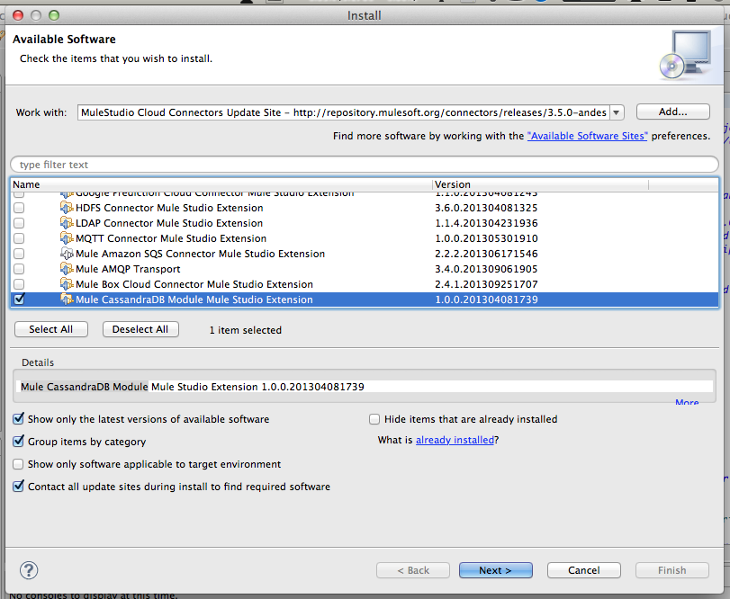
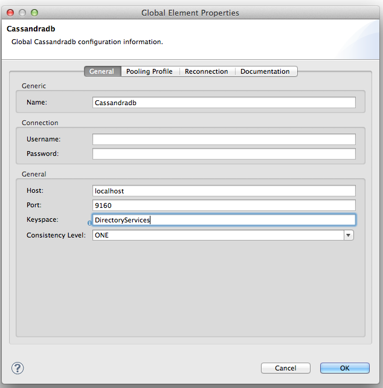
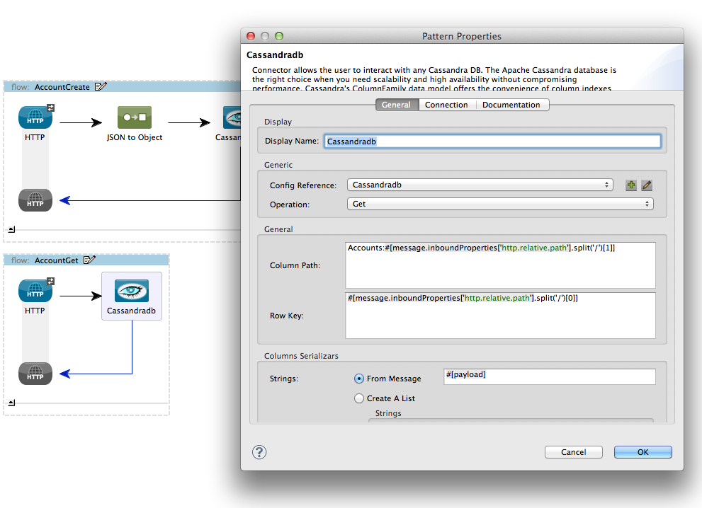
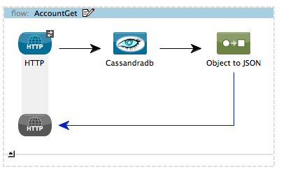

[Purpose](#purpose)  

[Prerequisites](#prerequisites)  

[Step 1: Install Apache Cassandra](#step-1-install-cassandra)    

[Step 2: Install Mule CassandraDB Connector from Update Site](#step-2-install-mule-cassandra-db-connector-from-update-site)   

[Step 3: Create DirectoryServices project ](#step3)  

[Step 4: Add a Cassandra Connector](#step4)   

[Step 5: Add the AccountCreate Flow](#step5)    

[Step 6: Create the AccountGet Flow](#step6)   

[Step 7: Run the DirectoryServices project](#step7)  

[Step 8: Test AccountCreate Flow](#step8)  

[Step 9: Test AccountGet Flow](#step9)   

[Flow XML](#flowXML)    

[Other Resources](#other)    

### Purpose

This document provides detailed instructions on how to install MuleSoft's Apache Cassaandra connector and demonstrates how to build and run simple demo application that uses this connector. Our demo application will implement a simple directory service that lets us store and query for users.

### Prerequisites

In order to build and run this project you'll need:

* An instance of Cassandra to connect to (http://cassandra.apache.org/).

* [MuleStudio](http://www.mulesoft.org/download-mule-esb-community-edition).

### Step 1: Install Apache Cassandra

* Follow instructions here to install Cassandra [http://cassandra.apache.org/](http://cassandra.apache.org/).

* Create a "DirectoryServices" keyspace using cassandra-cli.

### Step 2: Install Mule CassandraDB Module from update Site

*    In Mule Studio select **Help** \> **Install New Software...**.

*    Select **MuleStudio Cloud Connectors Update Site** in **Work With** drop-down.

*    Check "Mule CassandraDB Module" and click **Next**.

*    Follow installation steps.

### Step 3: Create DirectoryServices project

*    Run Mule Studio and select **File \> New \> Mule Project** menu item.  

*    Type **DirectoryServices** as a project name and click **Next**.  

Accept default values on the next screen of project creation wizard and click **Finish**.

### Step 4: Add a Cassandra Connector   

*    Double click on **src/main/app/DirectoryServices.xml** to open it, select **Global Elements** tab in view.

 

*    Click on **Create** button and add **CassandraDB** to the configuration. 

*    Set the CassandraDB Connector parameters as displayed on the following screenshot.  
  

### Step 5. Add the AccountCreate Flow

* Switch to **Message Flow** tab and add a new flow by dragging an HTTP endpoint from the palette.
 

* Name the new flow **AccountCreate**. It can be done by right-clicking on flow's header and selecting **Rename** from context menu.  

* Add **HTTP Endpoint** to your flow by dragging it from the palette. Double click it to display properties and configure it as follows: 

  

* Add **JSON to Object Transformer** to the flow by dragging it from the palette. 

<!--
-->

Now we can add the CassandraDB Message Processor to store the Map in Cassandra:

### Step 6. Create the AccountGet Flow

* Switch to **Message Flow** tab and add a new flow by dragging an HTTP endpoint from the palette.
 
* Name the new flow **AccountGet**. It can be done by right-clicking on flow's header and selecting **Rename** from context menu as above.  

* Add **HTTP Endpoint** to your flow by dragging it from the palette. Double click it to display properties and configure it as follows: 

* Add a **CassandraDB** message processor to get the appropriate row:

* Finally add an object-to-json-transformer to change the result to JSON:

### Step 7: Run the DirectoryServices project

*     Right Click on **flows/DirectoryServices.mflow \> Run As/Mule Application**.

*     Check the console to see when the application starts.

            ++++++++++++++++++++++++++++++++++++++++++++++++++++++++++++    

            + Started app 'directoryservices'                                       +

            ++++++++++++++++++++++++++++++++++++++++++++++++++++++++++++

### Step 8: Test AccountCreate Flow

* Use wget or RESTConsole to POST the following JSON to http://localhost:8080/accounts/create

		
		{
    	"Accounts":{
    	
        	"engineering":{
        	
            	"joe@acmesoft.com":{
            	
                	"Name":"Joe Developer",
                	
	                "Password":"286755fad04869ca523320acce0dc6a4",
	                
                "passwordAge": 731400
                
            },
            
            "jane@acmesoft.com":{
            
                "Name":"Jane Developer",
                
                "Password":"10b222970537b97919db36ec757370d2",
                
               	"passwordAge": 10082400
               	
            },
            "john@acmesoft.com":{
                "Name":"Jane Developer",
                "Password":"10b222970537b97919db36ec757370d2",
                "passwordAge": 1080000
            }
        },
        "operations":{
            "bill@acmesoft.com":{
                "Name":"Bill SysAdmin",
                "Password":"f1f16683f3e0208131b46d37a79c8921",
                "passwordAge": 4343100
            },
            "jill@acmesoft.com":{
                "Name":"Jill NetworkAdmin",
                "Password":"32a3571fa12b39266a58d42234836839",
                "passwordAge": 41923143
            }
        }
    }
}

### Step 9: Test AccountGet Flow

You can get a user in the directory by using a URL like the following:

http://localhost:8081/account/get/operations/bill@acmesoft.com

### Final Flow XML

The final flow XML should look like this:

    <?xml version="1.0" encoding="UTF-8"?>

	<mule xmlns:json="http://www.mulesoft.org/schema/mule/json"
	xmlns:cassandradb="http://www.mulesoft.org/schema/mule/cassandradb" xmlns:http="http://www.mulesoft.org/schema/mule/http" xmlns:tracking="http://www.mulesoft.org/schema/mule/ee/tracking" xmlns="http://www.mulesoft.org/schema/mule/core" xmlns:doc="http://www.mulesoft.org/schema/mule/documentation" xmlns:spring="http://www.springframework.org/schema/beans" version="EE-3.4.0" xmlns:xsi="http://www.w3.org/2001/XMLSchema-instance" xsi:schemaLocation="http://www.mulesoft.org/schema/mule/json http://www.mulesoft.org/schema/mule/json/current/mule-json.xsd
	http://www.springframework.org/schema/beans http://www.springframework.org/schema/beans/spring-beans-current.xsd
	http://www.mulesoft.org/schema/mule/core http://www.mulesoft.org/schema/mule/core/current/mule.xsd
	http://www.mulesoft.org/schema/mule/http http://www.mulesoft.org/schema/mule/http/current/mule-http.xsd
	http://www.mulesoft.org/schema/mule/cassandradb http://www.mulesoft.org/schema/mule/cassandradb/3.2/mule-cassandradb.xsd
	http://www.mulesoft.org/schema/mule/ee/tracking http://www.mulesoft.org/schema/mule/ee/tracking/current/mule-tracking-ee.xsd">
    <cassandradb:config name="Cassandradb" keyspace="DirectoryServices" doc:name="Cassandradb" password="xxx" username="xxx">
        <cassandradb:connection-pooling-profile initialisationPolicy="INITIALISE_ONE" exhaustedAction="WHEN_EXHAUSTED_GROW"/>
    </cassandradb:config>
    <flow name="AccountCreate" doc:name="AccountCreate">
        <http:inbound-endpoint 
            exchange-pattern="request-response" 
            host="localhost" 
            port="8081"
            path="account/create" 
            mimeType="application/json" doc:name="HTTP"/>
      <json:json-to-object-transformer 
               returnClass="java.util.Map" doc:name="JSON to Object"/>
        <cassandradb:insert-from-map config-ref="Cassandradb"     doc:name="Cassandradb">
            <cassandradb:content ref="#[payload]"/>
        </cassandradb:insert-from-map>
         <json:object-to-json-transformer /> 
        	</flow>
    <flow name="AccountGet" doc:name="AccountGet">
        <http:inbound-endpoint 
              exchange-pattern="request-response"
              host="localhost"
              port="8081" 
              path="account/get"   
              doc:name="HTTP"/>
        <logger message="FOOOO: #[message.inboundProperties['http.relative.path'].split('/')[0]]" level="INFO" doc:name="Logger"/>            
        <cassandradb:get config-ref="Cassandradb" 
               columnPath=
	"Accounts:#[message.inboundProperties['http.relative.path'].split('/')[1]]"
                rowKey=
	"#[message.inboundProperties['http.relative.path'].split('/')[0]]" doc:name="Cassandradb">
            <cassandradb:column-serializers ref="#[payload]"/>
        </cassandradb:get>         
 	<json:object-to-json-transformer doc:name="Object to JSON"/>
 	</flow>
	</mule>

  

### Other Resources

For more information on:

- Apache CassandraDB Connector, please visit [http://mulesoft.github.io/CassandraDB-connector/java/com/mulesoft/mule/cassandradb/CassandraDBConnector.html](http://mulesoft.github.io/CassandraDB-connector/java/com/mulesoft/mule/cassandradb/CassandraDBConnector.html)

- Mule AnyPoint™ connectors, please visit [http://www.mulesoft.org/connectors](http://www.mulesoft.org/connectors)

- Mule platform and how to build Mule apps, please visit [http://www.mulesoft.org/documentation/display/current/Home](http://www.mulesoft.org/documentation/display/current/Home)
